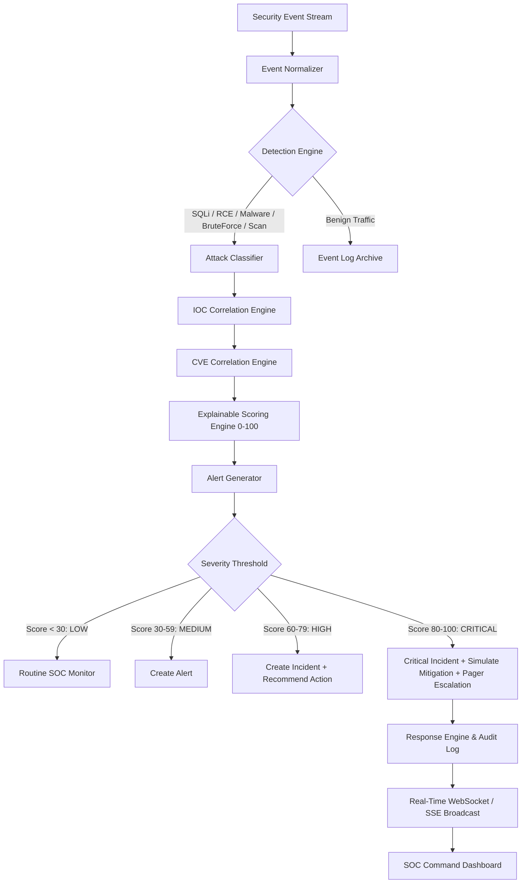

# PRISM — Proactive Response Intelligence Security Monitor

> Enterprise-grade cybersecurity threat detection, automated correlation, explainable scoring, and proactive mitigation platform.

[](https://www.python.org/)
[](https://fastapi.tiangolo.com/)
[](https://react.dev/)
[](https://www.docker.com/)
[](#testing)

---

## 1. Problem

Modern Security Operations Centers (SOCs) are overwhelmed by alert fatigue:
- Thousands of disparate security events flood telemetry streams every minute.
- Critical attacks (SQLi, RCE, malware beacons, credential stuffing) are obscured by noisy, unprioritized alerts.
- Triage latency averages over 4 hours because analysts must manually pivot between firewall logs, threat intelligence feeds, asset criticality registries, and CVE vulnerability databases.
- Automating responses traditionally carries extreme risks of accidental production service disruption.

---

## 2. Solution

**PRISM** delivers an automated, explainable end-to-end security pipeline:
1. **Real-time Event Ingestion & Normalization**: Ingests HTTP, endpoint, network, DNS, and authentication events into a standardized schema.
2. **Signature & Behavior Detection**: High-confidence detection of SQL Injection, Remote Code Execution, Malware/Trojans, Brute Force, and Port Scans.
3. **Automated IOC Correlation**: Automatically extracts IP, Domain, URL, Hash, and Email indicators and matches them against threat intelligence repositories.
4. **CVE Correlation**: Real-time cross-referencing against National Vulnerability Database (NVD) entries with CVSS scores.
5. **Explainable 0–100 Threat Scoring**: Transparent factor breakdown (Base Attack 0-40, IOC 0-25, CVE 0-20, Asset Criticality 0-10, Rule Confidence 0-5).
6. **Automated Safe Response in Simulation Mode**: Proactive mitigation (IP block, host quarantine, credential lock) without destructive production side effects.
7. **SOC Incident Escalation**: Immediate incident record creation, assignment, and real-time live alert streaming.

---

## 3. Architecture



---

## 4. Key Features

- **Professional SOC Theme**: Dark aesthetic with WCAG AA compliant contrast, tabular metrics, and dense scannability.
- **Attack Simulator (Hackathon Centerpiece)**: One-click attack scenario generator demonstrating the entire 11-step pipeline in real time.
- **Explainable Scoring Drawer**: Detailed mathematical inspection showing exactly why an attack was classified and scored.
- **Live Demo Mode**: Generates continuous background attacks evaluated through the real pipeline.
- **Full Threat Intel & IOC Catalog**: Searchable database supporting IP, Domain, Hash, URL, and Email indicators.
- **CVE Intelligence**: Real-time correlation with live NVD synchronization capabilities.
- **Safe Simulation Mode**: Enforces `RESPONSE_MODE=simulation` by default to safeguard infrastructure while logging complete audit trails.

---

## 5. Technology Stack

### Backend
- **Python 3.12+** / **FastAPI**
- **SQLAlchemy 2.0** + **PostgreSQL**
- **Pydantic v2** data validation
- **Uvicorn** ASGI server
- **unittest** & **pytest** test harness

### Runtime Fullstack Engine
- **Express + Vite Node.js runtime** on Port 3000
- **TypeScript 5.7+**
- **Server-Sent Events** real-time alert pipeline

### Frontend
- **React 19**
- **Tailwind CSS v4**
- **Lucide React** icons
- **Recharts** for SOC telemetry charts

---

## 6. Threat Scoring Formula (0–100)

$$\text{Threat Score} = \min(\text{Attack} + \text{IOC} + \text{CVE} + \text{Asset} + \text{Confidence}, 100)$$

| Factor | Range | Description |
| :--- | :--- | :--- |
| **Base Attack Severity** | 0 – 40 | RCE: +40, Malware: +38, SQLi: +35, Brute Force: +25, Port Scan: +20 |
| **IOC Match** | 0 – 25 | Critical IOC: +25, High IOC: +20, Medium IOC: +12 |
| **CVE Correlation** | 0 – 20 | CVSS $\ge 9.0$: +20, CVSS 7.0–8.9: +15, CVSS $< 7.0$: +10 |
| **Asset Criticality** | 0 – 10 | Tier-1 Core DB/Payment: +8 to +10, Web Gateway: +6 to +7, Sandbox: +2 |
| **Behavior Confidence** | 0 – 5 | Rule Confidence $\ge 95\%$: +5, $\ge 90\%$: +4, $\ge 80\%$: +3 |

---

## 7. Installation & Docker Setup

Run PRISM with Docker Compose:

```bash
docker compose up --build
```

Access services:
- **Frontend Dashboard**: `http://localhost:3000`
- **Backend REST API**: `http://localhost:8000`
- **Interactive OpenAPI Docs**: `http://localhost:8000/docs`
- **PostgreSQL Database**: `localhost:5432`

---

## 8. Automated Testing

Run the test suite:

```bash
python3 -m unittest backend/tests/test_all.py
```

Test coverage includes:
- SQL Injection regex & signature matching
- Remote Code Execution command detection
- Malware hash & keyword correlation
- Authentication Brute Force window counters
- Port scanning reconnaissance detection
- IOC threat level evaluation
- CVE CVSS scoring correlation
- Threat score calculation & explainability
- Automated response decisions in simulation mode

---

## 9. API Reference

| Method | Endpoint | Description |
| :--- | :--- | :--- |
| `GET` | `/api/health` | Health monitor and system status |
| `GET` | `/api/dashboard/summary` | Real-time SOC KPI telemetry |
| `GET` | `/api/events` | List normalized security events |
| `POST` | `/api/events` | Ingest raw event through pipeline |
| `GET` | `/api/alerts` | Filtered security alert feed |
| `POST` | `/api/alerts/{id}/resolve` | Resolve active alert |
| `GET` | `/api/incidents` | Incident triage case list |
| `GET` | `/api/iocs` | Threat intelligence IOC catalog |
| `POST` | `/api/cves/sync` | Sync CVE records with NVD |
| `POST` | `/api/simulator/sql-injection` | Trigger live SQL injection simulation |
| `POST` | `/api/simulator/rce` | Trigger live RCE simulation |
| `GET` | `/api/stream/alerts` | Real-time SSE alert streaming |

---

## 10. License

Apache-2.0 License.
